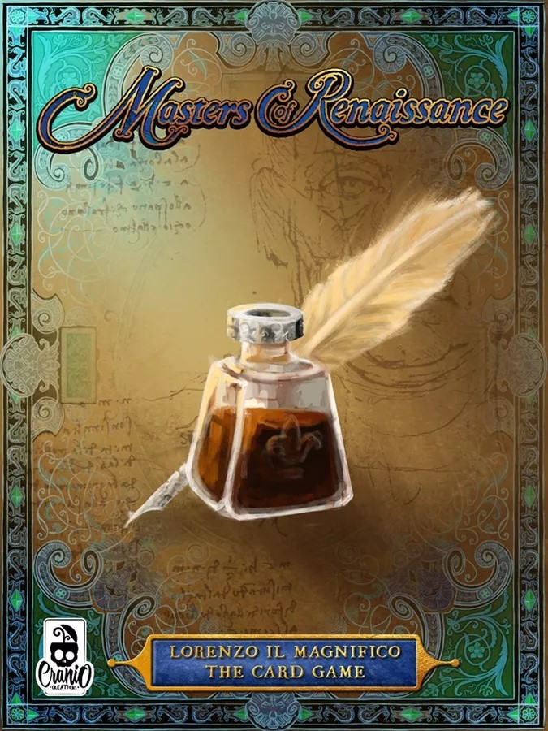

#Prova Finale di Ingegneria del Software - A.A. 2020 - 2021
####Andrea Chizzola, Davide Corigliano, Marco Colombo


[esempio link](AM19/AM19/src/main/resources/Images/login.png) 
##Introduction
The goal of the project is the implementation of the board game 'Masters 
of Renaissance'.  
The game has been implemented according to the Model
View Controller and allows to play using a CLI or a GUI. The project is
based on a distributed system, which can manage multiple and multiple
clients. Each player decide what kind of interface to use (CLI or GUI)
at the beginning of the game. The network relies on the use of sockets.

##Documentation
The following paragraphs contain the documentation realized during the 
implementation of the game, a description of the tools used, and of the
implemented functionalities.

###Implemented Functionalities
- Complete Rules
- CLI
- GUI
- Socket
- 3 Advanced Functionalities
    - Multiple Games - The server can manage multiple games at the same
    time.
    - Local Game - The client allows to play a solo game without connecting to
    the server.
    - Resilience to disconnection - The disconnected players can be reconnected
    to the game. While a player is disconnected, the game skips the turns of the
    disconnected player.
    
###UML
The following diagrams contain the initial UML of the model and the
final version of the model.  
The model has been modified based on the suggestions received during the
laboratories, and of the issues found during the implementation of the game

###Network Protocol
The following document contains the network protocol designed to manage
the communication between the client and the server.

###JavaDoc
The following document contains a description of the classes and the methods
implemented, in the form of JavaDoc.

###Tools used
- Maven - A project management tool. Maven manages the plugins, the tools, and the
libraries used in the project. Moreover, together with the plugin Shade, Maven
allows building JARs.
- JUnit - An open-source framework, used to write code tests.
- JavaFX - A Java library used for the creation of Graphical User Interfaces (GUI).
    
###Launching the game
The game can be launched from a terminal. Both the Client and the Server can be
launched from the same JAR. The JAR is located in the Shade directory.//TODO insert link to JAR
####Server
The Server can be launched using the following command
```
java -jar AM19.jar -server -port portNumber
```
The parameter `-port` represents the port used by the server. If omitted,
the port is 1234.

####Client - CLI
The Client can be launched with a CLI interface using the following command
```
java -jar AM19.jar -client -ip address -port portNumber --cli
```
The parameters `-port` and `-ip` represents the port and the address of the server respectively.
The parameter `--cli` represents the willingness of using a CLI interface.

Note: CLI should be launched terminal that supports ANSI escape, like Linux bash.
####Client - GUI
The Server can be launched using the following command
```
java -jar AM19.jar -client -ip addres -port portNumber --gui
```
The parameters `-port` and `-ip` represents the port and the address of the server respectively.
The parameter `--GUI` represents the willingness of using a GUI interface.  

Note: if `-port` and `-ip` are omitted, the client the port is 1234 and IP is 127.0.0.1 ;
if the type of interface is omitted, the interface is launched using CLI settings.
If a player disconnects himself during the initialization phase,
the game is over and all the players are disconnected.
###Members of the group:
- Andrea Chizzola - andrea.chizzola@mail.polimi.it
- Davide Corigliano - davide.corigliano@mail.polimi.it
- Marco Colombo - marco66.colombo@mail.polimi.it